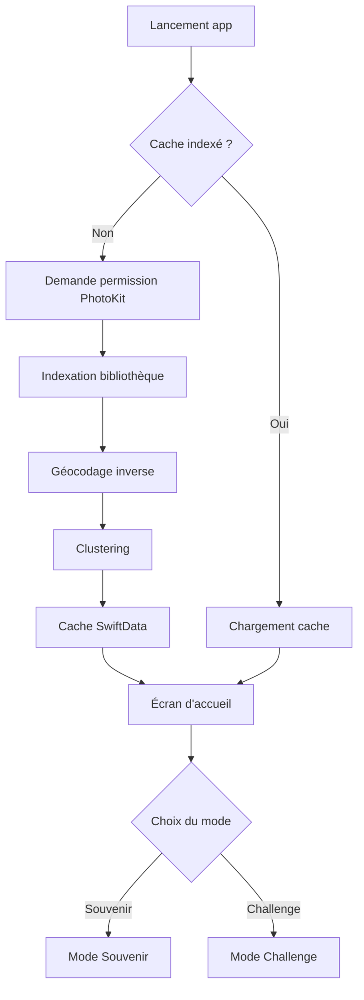

# Wanderback — Technique avancée, GitHub & Démarrage Xcode

> Complément aux specs principales · Pour un développeur PHP découvrant Swift/tvOS

---

## 1. UX Spécifique Apple TV (10-foot UI)

### 1.1 Le principe du "10-foot UI"

Apple TV est conçue pour être utilisée à ~3 mètres de distance. Tout le design en découle :

| Règle | Valeur | Pourquoi |
|---|---|---|
| Taille de police minimale | 36pt (corps), 28pt (légendes) | Lisibilité à 3m |
| Taille minimale des éléments focusables | 44×44pt | Zone de focus visible |
| Nombre de colonnes max | 2 (contenu comparatif) | Scan horizontal difficile |
| Safe zone (overscan) | 5% de chaque bord | Les TV anciennes coupent les bords |
| Contraste texte/fond | Ratio WCAG AA ≥ 4.5:1 | Variable selon le rétroéclairage |
| Fond recommandé | Sombre (#0a0a1a ou similaire) | Réduit la fatigue oculaire dans une pièce sombre |

### 1.2 Le système de Focus (tvOS)

Sur Apple TV, il n'y a pas de curseur souris ni de toucher — il y a le **focus**. Un seul élément est "en focus" à la fois, mis en avant visuellement. SwiftUI le gère automatiquement.

```swift
// SwiftUI — Bouton tvOS avec focus automatique
Button("Jouer") {
    // action
}
.buttonStyle(.card)  // Style natif tvOS : scale + halo au focus
```

Règles du focus :
- L'élément en focus est **agrandi (scale ~1.05)** et entouré d'un **halo lumineux** — comportement natif, ne pas le remplacer
- Navigation au D-pad (Siri Remote) : automatique avec SwiftUI si les éléments sont correctement layoutés
- Toujours définir le **focus initial** à l'arrivée sur un écran avec `@FocusState`

```swift
@FocusState private var focusedButton: GameButton?

var body: some View {
    VStack {
        Button("Jouer") { ... }.focused($focusedButton, equals: .play)
        Button("Réglages") { ... }.focused($focusedButton, equals: .settings)
    }
    .onAppear { focusedButton = .play }  // Focus initial sur "Jouer"
}
```

### 1.3 Animations adaptées à la TV

Les animations sur TV doivent être **plus lentes et fluides** qu'en mobile (le téléviseur a une inertie d'affichage) :
- Durée standard : 0.4–0.6s (vs 0.2–0.3s sur iPhone)
- Préférer les courbes `easeInOut` et `spring`
- L'animation de zoom de la carte : `withAnimation(.easeInOut(duration: 1.2))`

---

## 2. États de Chargement — Stratégie Complète

### 2.1 Vue d'ensemble des opérations lentes

```
OPÉRATION                        DURÉE ESTIMÉE    FRÉQUENCE
─────────────────────────────────────────────────────────────
Indexation initiale PhotoKit     10–60s           1 seule fois
  ↳ Lecture des GPS              ~5ms/photo
  ↳ Géocodage inverse            ~200ms/lieu
  ↳ Clustering                   ~1s total
Mise à jour delta (new photos)   1–5s             À chaque lancement
Chargement photo iCloud          1–5s             Par round
Chargement miniatures (cache)    <100ms           Par round
```

### 2.2 Stratégie par état

#### État A — Premier lancement (indexation)
Afficher l'écran de chargement complet avec barre de progression :

```swift
// Exemple de flux d'indexation
actor PhotoIndexer {
    func indexLibrary(progress: @escaping (Double, String) -> Void) async {
        let allAssets = fetchAllAssetsWithLocation()  // PHFetchResult
        let total = allAssets.count

        for (index, asset) in allAssets.enumerated() {
            // 1. Lire le GPS (instantané — déjà en mémoire)
            guard let location = asset.location else { continue }

            // 2. Géocodage inverse (lent — faire en batch throttlé)
            let placemark = await geocode(location)

            // 3. Mettre en cache (SwiftData)
            await cache.save(asset: asset, placemark: placemark)

            // 4. Reporter la progression
            let percent = Double(index + 1) / Double(total)
            progress(percent, "Analyse \(index + 1) / \(total)")
        }

        // 5. Calculer les clusters
        await clusterLocations()
    }
}
```

#### État B — Lancement normal (cache disponible)
Charger depuis SwiftData en <1s. Afficher un simple spinner 0.5s pendant le chargement du cache, puis l'écran d'accueil directement.

#### État C — Chargement d'une photo iCloud en cours de partie
La photo est "en cours de téléchargement" depuis iCloud (pas encore locale) :

```swift
// Squelette pendant le chargement
if photoIsLoading {
    // Afficher un rectangle avec animation shimmer (dégradé qui défile)
    ShimmerView()
        .frame(maxWidth: .infinity, maxHeight: .infinity)
} else {
    Image(uiImage: loadedPhoto)
        .resizable()
        .scaledToFill()
        .transition(.opacity.animation(.easeIn(duration: 0.4)))
}
```

Le **shimmer effect** (dégradé animé sur fond gris) est le meilleur pattern skeleton pour une photo de taille inconnue.

#### État D — Timeout / Hors ligne
Si la photo ne se charge pas en 10 secondes :
- Afficher une photo de substitution (flou de fond avec le nom du lieu masqué)
- Proposer "Photo suivante" ou "Réessayer"
- Logger l'asset identifier pour le retenter plus tard

#### État E — Bibliothèque sans GPS
Si l'utilisateur n'a aucune photo avec coordonnées GPS :

```
[ 📸 ]
Aucun lieu trouvé dans tes photos

Wanderback utilise les coordonnées GPS de tes photos.
Active "Services de localisation" pour l'app Photo sur iPhone.

→ Comment faire ?     → Utiliser des photos de démonstration
```

### 2.3 Géocodage inverse — Throttling

```swift
class GeocoderService {
    private let geocoder = CLGeocoder()
    private var requestCount = 0
    private let maxRequestsPerMinute = 45  // marge sous la limite Apple (50/min)

    func geocode(_ location: CLLocation) async throws -> CLPlacemark? {
        // Vérifier le cache d'abord
        if let cached = cache.lookup(coordinate: location.coordinate) {
            return cached
        }

        // Throttle : attendre si on approche la limite
        if requestCount >= maxRequestsPerMinute {
            try await Task.sleep(nanoseconds: 60_000_000_000)  // 1 minute
            requestCount = 0
        }

        requestCount += 1
        let placemarks = try await geocoder.reverseGeocodeLocation(location)
        let placemark = placemarks.first

        // Mettre en cache pour ne jamais re-géocoder ce point
        if let placemark { cache.save(location: location, placemark: placemark) }
        return placemark
    }
}
```

---

## 3. Structure GitHub

### 3.1 Organisation du repo

```
wanderback/
├── Wanderback.xcodeproj/
├── Wanderback/                    # Code source principal
│   ├── App/
│   ├── Models/
│   ├── ViewModels/
│   ├── Views/
│   ├── Services/
│   └── Persistence/
├── WanderbackTests/               # Tests unitaires (XCTest)
├── WanderbackUITests/             # Tests UI (XCUITest)
├── docs/
│   ├── wanderback-specs.md       # Ce fichier de specs
│   ├── wanderback-wireframes.html
│   └── wanderback-technique-et-setup.md
├── .gitignore
└── README.md
```

### 3.2 Fichier .gitignore pour Xcode

```gitignore
# Xcode
*.xcuserstate
xcuserdata/
*.xcworkspace/xcuserdata/
DerivedData/
build/
*.moved-aside
*.pbxuser
!default.pbxuser
*.mode1v3
!default.mode1v3
*.mode2v3
!default.mode2v3
*.perspectivev3
!default.perspectivev3

# macOS
.DS_Store
.AppleDouble
.LSOverride

# Swift Package Manager
.build/
.swiftpm/

# Données sensibles
*.p12
*.mobileprovision
```

### 3.3 Labels GitHub suggérés

| Label | Couleur | Usage |
|---|---|---|
| `feature` | #0075ca | Nouvelle fonctionnalité |
| `bug` | #d73a4a | Comportement inattendu |
| `performance` | #e4e669 | Optimisation, lenteur |
| `ux` | #7057ff | Design, interactions |
| `photokit` | #0052cc | Lié à l'accès photos |
| `geocoding` | #006b75 | Lié au géocodage/localisation |
| `v1-mvp` | #1d76db | Milestone V1 |
| `v2` | #5319e7 | Milestone V2 |
| `good-first-issue` | #7fc97f | Issue accessible pour débuter |

### 3.4 Milestones suggérés

**Milestone V1 — MVP fonctionnel**
Issues à créer :
- `[SETUP] Créer le projet Xcode tvOS avec SwiftUI`
- `[PHOTOKIT] Demande d'autorisation + lecture des assets`
- `[PHOTOKIT] Filtrage des photos avec coordonnées GPS`
- `[GEOCODING] Service de géocodage inverse avec cache SwiftData`
- `[CLUSTERING] Algorithme de regroupement par lieu`
- `[GAME] Génération d'une question (photo + 4 options)`
- `[GAME] Écran de jeu avec HUD (round, score, chrono)`
- `[GAME] Écran de révélation simple (lieu + carte statique)`
- `[GAME] Écran récapitulatif`
- `[LOADING] Écran d'indexation avec barre de progression`

**Milestone V2 — Enrichissement**
- `[UX] Animation cinématique carte (zoom MapKit)`
- `[UX] Diaporama photos du même voyage sur révélation`
- `[GAME] Mode Souvenir complet`
- `[GAME] Sélection de voyage / année`
- `[PERF] Prefetch photos avec PHCachingImageManager`

### 3.5 Template d'issue GitHub

Créer le fichier `.github/ISSUE_TEMPLATE/feature.md` :

```markdown
---
name: Feature
about: Nouvelle fonctionnalité ou amélioration
labels: feature
---

## Description
<!-- Que faut-il développer ? -->

## Contexte
<!-- Pourquoi c'est nécessaire ? Quel écran/flux est concerné ? -->

## Critères d'acceptation
- [ ] ...
- [ ] ...

## Notes techniques
<!-- Frameworks, contraintes, liens vers les specs -->

## Milestone
<!-- V1 / V2 / V3 -->
```

---

## 4. Démarrage du Projet Xcode — Tutoriel Pas-à-Pas

### 4.1 Prérequis

- **Mac** avec macOS Ventura ou Sequoia
- **Xcode 15** ou plus récent (gratuit sur le Mac App Store)
- **Apple TV** physique connectée au même réseau WiFi (pour tester) — ou le Simulateur Apple TV intégré à Xcode

> 💡 En tant que développeur PHP, tu vas retrouver des concepts familiers : les `ViewModels` ressemblent aux Controllers, les `Models` aux entités Doctrine, et SwiftUI est déclaratif comme React.

### 4.2 Créer le projet

1. Ouvrir **Xcode**
2. Cliquer `File → New → Project…` (ou ⌘⇧N)
3. Choisir l'onglet **tvOS** (en haut de la fenêtre)
4. Sélectionner le template **App**
5. Remplir les champs :

| Champ | Valeur |
|---|---|
| Product Name | `Wanderback` |
| Team | Ton Apple ID (si tu en as un) |
| Organization Identifier | `com.tonnom` (ex: `com.bastien`) |
| Bundle Identifier | auto-généré : `com.bastien.Wanderback` |
| Interface | **SwiftUI** ← Important |
| Language | **Swift** |
| Storage | None |

6. Choisir le dossier où créer le projet → `Create`

### 4.3 Structure initiale générée

Xcode crée automatiquement :
```
Wanderback/
├── WanderbackApp.swift   ← Point d'entrée (comme index.php)
├── ContentView.swift      ← L'écran de base (à renommer en HomeView)
└── Assets.xcassets/       ← Images, icônes, couleurs
```

### 4.4 Ajouter la permission PhotoKit

Ouvrir le fichier `Wanderback/Info.plist` et ajouter la clé de permission :

1. Dans le navigateur gauche de Xcode, cliquer sur `Wanderback` (le projet)
2. Sélectionner la target `Wanderback`
3. Onglet **Info**
4. Dans la section "Custom tvOS Target Properties", cliquer `+`
5. Ajouter la clé : `Privacy - Photo Library Usage Description`
6. Valeur : `Wanderback utilise vos photos pour créer des questions personnalisées basées sur vos voyages.`

Ou directement en éditant `Info.plist` (clic droit → Open As → Source Code) :

```xml
<key>NSPhotoLibraryUsageDescription</key>
<string>Wanderback utilise vos photos pour créer des questions personnalisées basées sur vos voyages.</string>
```

### 4.5 Lancer le simulateur Apple TV

1. En haut à gauche de Xcode, cliquer sur le sélecteur de device (il affiche "Any tvOS Device")
2. Choisir `Apple TV 4K (3rd generation)` dans la liste des simulateurs
3. Appuyer sur **▶ Run** (ou ⌘R)
4. Le simulateur Apple TV s'ouvre avec l'app

> 💡 Dans le simulateur, utilisez les touches clavier pour simuler la télécommande :
> - Flèches directionnelles → D-pad
> - Espace → Clic (sélection)
> - Escape → Bouton Menu

### 4.6 Organiser les dossiers du projet

Xcode gère les dossiers via des "Groups". Pour créer la structure du projet :

1. Clic droit sur le dossier `Wanderback` dans le navigateur → `New Group`
2. Créer les groupes : `Models`, `ViewModels`, `Views`, `Services`, `Persistence`
3. Déplacer `ContentView.swift` dans `Views` (glisser-déposer dans le navigateur)

### 4.7 Premier code — Demande d'accès à la bibliothèque

Remplacer le contenu de `ContentView.swift` (renommé `HomeView.swift`) par :

```swift
import SwiftUI
import Photos

struct HomeView: View {
    @State private var authorizationStatus: PHAuthorizationStatus = .notDetermined
    @State private var photoCount: Int = 0

    var body: some View {
        VStack(spacing: 32) {
            Text("Wanderback")
                .font(.system(size: 60, weight: .bold))
                .foregroundColor(.white)

            switch authorizationStatus {
            case .authorized, .limited:
                Text("📸 \(photoCount) photos trouvées")
                    .font(.title2)
                    .foregroundColor(.secondary)

                Button("▶ Jouer") {
                    // TODO: lancer le jeu
                }
                .buttonStyle(.card)

            case .denied, .restricted:
                Text("⚠️ Accès aux photos refusé")
                    .foregroundColor(.red)
                Text("Va dans Réglages → Privacy → Photos pour autoriser Wanderback")
                    .font(.caption)
                    .foregroundColor(.secondary)
                    .multilineTextAlignment(.center)

            case .notDetermined:
                Button("Accéder à mes photos") {
                    requestPhotoAccess()
                }
                .buttonStyle(.card)

            @unknown default:
                EmptyView()
            }
        }
        .frame(maxWidth: .infinity, maxHeight: .infinity)
        .background(Color.black)
        .onAppear {
            checkPhotoAccess()
        }
    }

    private func checkPhotoAccess() {
        authorizationStatus = PHPhotoLibrary.authorizationStatus(for: .readWrite)
        if authorizationStatus == .authorized || authorizationStatus == .limited {
            countPhotos()
        }
    }

    private func requestPhotoAccess() {
        PHPhotoLibrary.requestAuthorization(for: .readWrite) { status in
            DispatchQueue.main.async {
                authorizationStatus = status
                if status == .authorized || status == .limited {
                    countPhotos()
                }
            }
        }
    }

    private func countPhotos() {
        let options = PHFetchOptions()
        options.predicate = NSPredicate(format: "mediaType == %d", PHAssetMediaType.image.rawValue)
        let result = PHAsset.fetchAssets(with: options)
        photoCount = result.count
    }
}
```

### 4.8 Connecter l'Apple TV physique (optionnel)

Pour tester sur une vraie Apple TV (recommandé pour tester le comportement de la télécommande et les perfs iCloud) :

1. Sur l'Apple TV : `Réglages → Réseau` → noter l'adresse IP
2. Sur l'Apple TV : `Réglages → Système → Partage → Developers` → activer
3. Dans Xcode : `Window → Devices and Simulators` → `+` → entrer l'IP de l'Apple TV
4. L'Apple TV apparaît dans le sélecteur de device

> ⚠️ Pour déployer sur Apple TV physique, il faut un compte développeur Apple (99€/an) ou un compte gratuit limité à 7 jours de déploiement.

### 4.9 Workflow Git avec Xcode

Xcode a une intégration Git native mais il est plus simple d'utiliser le terminal :

```bash
# Dans le dossier du projet (terminal macOS)
cd /chemin/vers/Wanderback

# Initialiser git
git init
git remote add origin https://github.com/TON_COMPTE/wanderback.git

# Premier commit
git add .
git commit -m "Initial project setup — tvOS SwiftUI template"
git push -u origin main
```

Pour les commits suivants, tu peux utiliser GitHub Desktop (app gratuite) ou le terminal.

---

## 5. Outils Recommandés pour les Wireframes & Schémas

### Pour les wireframes d'écrans

| Outil | Prix | Points forts | Idéal pour |
|---|---|---|---|
| **Figma** | Gratuit (plan perso) | Collaboration, frames TV 1920×1080 dispo, export | Wireframes précis + handoff vers dev |
| **Whimsical** | Gratuit (limité) | Rapide, simple, bien pour les flows | User flows et wireframes basse fidélité |
| **Excalidraw** | Gratuit | Sketch style, open source, dans le navigateur | Brainstorming rapide, look "fait main" |
| **draw.io / diagrams.net** | Gratuit | Diagrammes techniques, flows, architectures | Diagrammes d'architecture et de flux |
| **Balsamiq** | 9€/mois | Low-fi intentionnel, rapide | Maquettes rapides sans se perdre dans le style |

> 💡 Recommandation : commence avec **Figma** (gratuit, très utilisé) et crée un frame "Apple TV — 1920×1080". La communauté a des templates tvOS disponibles.

### Pour l'architecture et les diagrammes techniques

| Outil | Usage |
|---|---|
| **draw.io** | Diagrammes d'architecture, flux de données |
| **Mermaid** (Markdown) | Diagrammes as-code intégrables dans GitHub |
| **PlantUML** | Diagrammes UML, séquences |

Exemple de diagramme Mermaid (s'affiche directement dans GitHub) :



### Pour les icônes de l'app

- **SF Symbols** (Apple, gratuit) — bibliothèque de 6000+ icônes vectorielles conçues pour l'écosystème Apple. App macOS à télécharger sur le site Apple.
- **Noun Project** — icônes thématiques si SF Symbols ne suffit pas

---

## 6. Conseils pour Débuter Swift en Venant de PHP

| Concept PHP | Équivalent Swift |
|---|---|
| `class` | `class` (référence) ou `struct` (valeur — privilégier) |
| `interface` | `protocol` |
| `$variable` | `var variable` (mutable) ou `let variable` (constante) |
| `array` | `Array<Type>` ou `[Type]` |
| `null` | `nil` — Swift utilise les Optionals (`String?`) |
| `echo` | `print()` |
| `foreach ($items as $item)` | `for item in items { }` |
| Closure anonyme `function() {}` | `{ }` (trailing closure) |
| `async/await` (PHP 8) | `async/await` — identique en Swift 5.5+ |
| `try/catch` | `do { try } catch { }` |
| Namespace | Module (automatique par target Xcode) |
| Composer | Swift Package Manager (intégré à Xcode) |

Swift est un langage à **typage fort** comme PHP 8 avec `declare(strict_types=1)` mais poussé à l'extrême : impossible de passer un `String` là où un `Int` est attendu, même implicitement.

---

*Complément de specs — Wanderback · Version 1.0 · Mars 2026*
